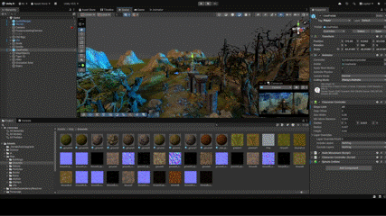

# TPSControlles - Basic 3rd Person Controller & AI Sandbox

> **Status:** Open Source / Legacy Project (2019)
> **Tech Stack:** Unity 3D, C#, NavMesh AI

Este proyecto comenzó como un controlador de personaje pulido (movimiento, saltos, física) y evolucionó hacia un "Sandbox" para probar diferentes comportamientos de Inteligencia Artificial agresiva y reactiva.

### 🧠 Comportamientos de IA (Enemy AI)
El proyecto incluye varios NPCs con máquinas de estados únicas:

* **The Chasers (Gorila & Tigre):** IA basada en *NavMeshAgent* que patrulla y entra en estado de persecución (Chase State) al detectar al jugador en un radio específico.
* **The "Tricky" NPC (Terrorista):** IA con comportamiento pasivo-agresivo. Se burla del jugador a distancia, pero ataca si se rompe la "zona de confort".
* **The Alien:** IA reactiva con estados inusuales (Breakdance/Taunt) al interactuar con el jugador.

### 🎥 Demos

<video controls src="kenner-letelier/ThirdPersonController_En_Entornos3D/Media/TP-Video.mp4" title="Title"></video>
### 💻 Código Destacado
* **`PlayerController.cs`**: Lógica principal de movimiento y físicas (Core del proyecto).
* **`EnemyAI.cs`**: Implementación de la máquina de estados (Idle -> Chase -> Attack).
